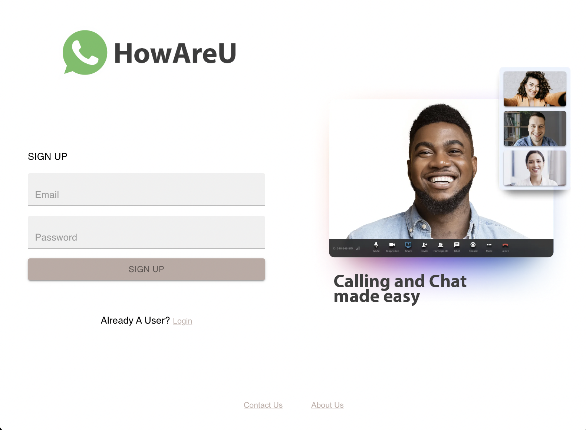

# Whatsapp Clone
### Project Summery
This [React](https://reactjs.org/) project allows users to signup, connect and chat with other users.
- Use Firebase to authenticate users and email verification
- Use Quickblox for messaging
- Use Postgres/NodeJs server to handle api request
- Use React Query and redux to manage client/server state
- Use Mui for styled components

**Interactive Demo**
[HowAreU: Chat app](https://whatsapp-clone-f4523.web.app/)

**Installation**
clone the repo and navigate to the folder and run
- **npm install** to install project dependencies
- **npm start** to launch the app
